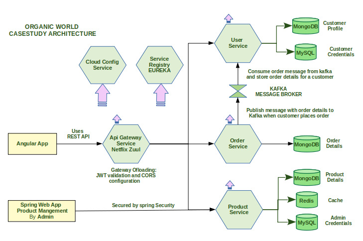

## Organic World Case study - Implementing Microservices patterns

#### See PROBLEM.md for detailed requirements

### Architecture Diagram of the Application
	

	
### Objective
    You are provided with the Base code having the implementation of the above architecture

	The Objective of this assignment is to enhance this application as given below:

    - Containerize the application and migrate it to k8s.
      - Create a new `k8s` folder and place all kubernetes manifests files in it
    - Deploy the application on the cloud (EKS, AKS or GKE)
    - Replace Netflix Zuul with istio
      - Configure Ingress rules and routing with Istio
    - Configure mTLS, authorization, rate limiting (10requests / 5s), timeouts (3s), retries (3), connection pooling (4 connections), and bulk heading
    - Configure SSL Certificate for the Ingress Gateway
    - Configure Authorization for HTTP traffic
    - Configure CI/CD for the project
    - Document Deployment steps in DEPLOYMENT.md

#### To use this as a boilerplate for your new project, you can follow these steps

1. **FORK** this repository in your Gitlab account

2. **CLONE** the forked repository, containing the boilerplate in your local machine

    `git clone sa_fseinc_java_microservices_organicworld_solution`

3. Navigate to the cloned folder

    `cd sa_fseinc_java_microservices_organicworld_solution`

4. Check the status of your repo 
	     
     `git status`

5. Use the following command to update the index using the current content found in the working tree, to prepare the content staged for the next commit.

     `git add .`
	 
6. Commit and Push the project to git

     `git commit -a -m "Initial commit | or place your comments according to your need"`

     `git push -u origin master`

7. Check on the git repo online, if the files have been pushed

### Important instructions for Participants
> - We expect you to write the assignment on your own by following through the guidelines, learning plan, and the practice exercises
> - The code must not be plagirized, the mentors will randomly pick the submissions and may ask you to explain the solution
> - The code must be properly indented, code structure maintained as per the boilerplate and properly commented
> - Follow through the problem statement shared with you

### MENTORS TO BEGIN REVIEW YOUR WORK ONLY AFTER ->
> - You add the respective Mentor as a Reporter/Master into your Assignment Repository
> - You have checked your Assignment on the Automated Evaluation Tool - Hobbes (Check for necessary steps in your Boilerplate - README.md file. ) and got the required score - Check with your mentor about the Score you must achieve before it is accepted for Manual Submission.
> - Intimate your Mentor on Slack and/or Send an Email to learner.support@stackroute.in - with your Git URL - Once you done working and is ready for final submission.

### Further Instructions on Release

*** Release 0.1.0 ***

    To test the project, run the below maven commands
        mvn clean test
    
    To run the project, see instructions in PROBLEM.md	
